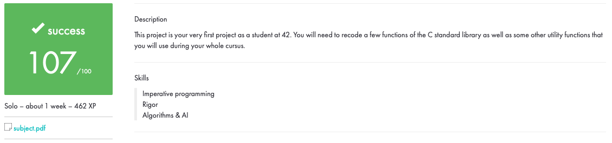

# libft
*My first library for 42 school Madrid.*

C programming can be very tedious when one doesn’t have access to those highly useful standard functions.

This project objetive is to re-write those functions, understand them, and learn to use them.

Updated with get_next_line

## Usage
Use Makefile provided to compile. There is a *Make bonus* rule to compile some extra functions.

Enjoy!
